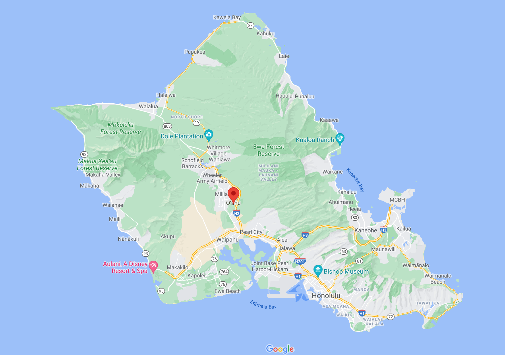

# surfs_up

## Overview

- The purpose of this analysis is to help an entrepreneur to analyze if the weather in Oahu, Hawaii is suitable to open a Surf n' Shake store and convince a potential investor to inject capital.
- An api endpoint is designed to facilitate data delivering and results comunication.




## Results

### Relevant differences June vs December

The following table is a resume of the June and December temperatures.

- December has an average temperature almost four grades under June.
- Maximum temperatures only presents a gap of 2 grades.
- While minimum temperatures present a gap of 8 grades.

### Table of results

| |June Temps | December Temps |
|:---:|:---:|:---:|
| count | 1700 | 1517 |
| mean | 74.944118 | 71.041529 |
| std | 3.257417 | 3.745920 |
| min | 64 | 56 |
| 25% | 73 | 69 |
| 50% | 75 | 71 |
| 75% | 77 | 74 |
| max | 85 | 83 |

### Api End point

- An api endpoint was prepared to facilitate other potential investores to obtain the data of the climate analysis.
- A template was used to improve the user experience.


### Aditional feature

- As a bonus fature an aditional route was added:
  - /api/v1.0/describe/start/end
- This endpoint delivers the temperature and precipitation description for any date range selected.


#### Aditional feature code

```Python

@app.route("/api/v1.0/describe/<start>")
@app.route("/api/v1.0/describe/<start>/<end>")
def temp_resume(start=None, end=None):

    sel_temp = [Measurement.date, Measurement.tobs]
    sel_precp = [Measurement.date, Measurement.prcp]

    # Obtain filtered temp results
    if not end:

        session = Session(engine)
        results_temp = session.query(*sel_temp).\
            filter(Measurement.date >= start).all()
        session.close()

        session = Session(engine)
        results_precp = session.query(*sel_precp).\
            filter(Measurement.date >= start).all()
        session.close()

        myTitle = f"<h1>Results from {start}</h1>"

    else:

        session = Session(engine)
        results_temp = session.query(*sel_temp).\
            filter(Measurement.date >= start).\
            filter(Measurement.date <= end).all()
        session.close()

        session = Session(engine)
        results_precp = session.query(*sel_precp).\
            filter(Measurement.date >= start).\
            filter(Measurement.date <= end).all()
        session.close()

        myTitle = f"<h1>Results from {start} to {end}</h1>"

    # Create list
    list_temps = [(date, temp) for date, temp in results_temp]
    list_precp = [(date, precp) for date, precp in results_precp]

    # Create data frame
    myTempHeader = "<h2>Temperature</h2>"
    df_temp = pd.DataFrame(list_temps, columns=['date','Temps'])
    df_temp_html = df_temp.describe().to_html()

    myPrecpHeader = "<h2>Precipitation</h2>"
    df_precp = pd.DataFrame(list_precp, columns=['date','Precp'])
    df_precp_html = df_precp.describe().to_html()

    return (f"{myTitle} <br> {myTempHeader} {df_temp_html} <br> {myPrecpHeader} {df_precp_html}")
    # return jsonify(temps)

```

## Summary

- Maximum temperatures gap between December and June seems small enough to expect a good weather for the store all year long.
- Precipitation results indicate also a very stable results even presenting less average precipitation in June vs December.

| |June Prec | December Prec |
|:---:|:---:|:---:|
| count | 1584 | 1405 |
| mean | 0.136360 | 0.216819 |
| std | 0.335731 | 0.541399 |
| min | 0.000000 | 0.000000 |
| 25% | 0.000000 | 0.000000 |
| 50% | 0.020000 | 0.030000 |
| 75% | 0.120000 | 0.150000 |
| max | 4.430000 | 6.420000 |
